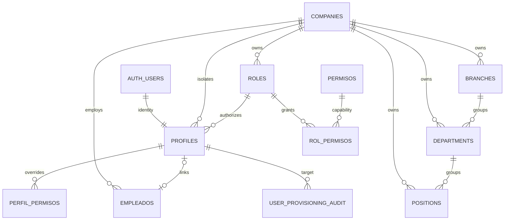

# Database ERD

```mermaid
erDiagram
 AUTH_USERS ||--|| PROFILES : identity
 COMPANIES ||--o{ ROLES : owns
 COMPANIES ||--o{ BRANCHES : owns
 COMPANIES ||--o{ DEPARTMENTS : owns
 COMPANIES ||--o{ POSITIONS : owns
 COMPANIES ||--o{ PROFILES : isolates
 COMPANIES ||--o{ EMPLEADOS : employs
 ROLES ||--o{ PROFILES : authorizes
 ROLES ||--o{ ROL_PERMISOS : grants
 PERMISOS ||--o{ ROL_PERMISOS : capability
 PROFILES ||--o{ PERFIL_PERMISOS : overrides
 PROFILES o|--o| EMPLEADOS : links
 PROFILES ||--o{ USER_PROVISIONING_AUDIT : target
 BRANCHES ||--o{ DEPARTMENTS : groups
 DEPARTMENTS ||--o{ POSITIONS : groups
```

Las FK compuestas `(company_id,id)` impiden cruces de tenant.
