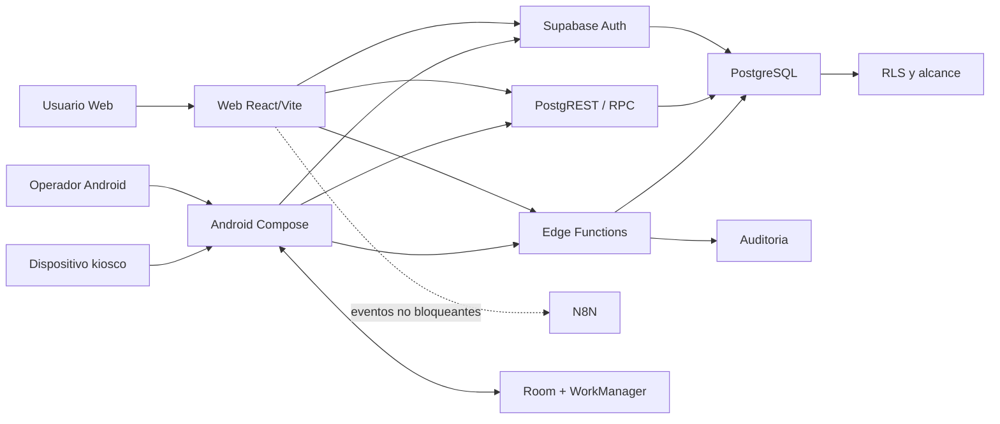
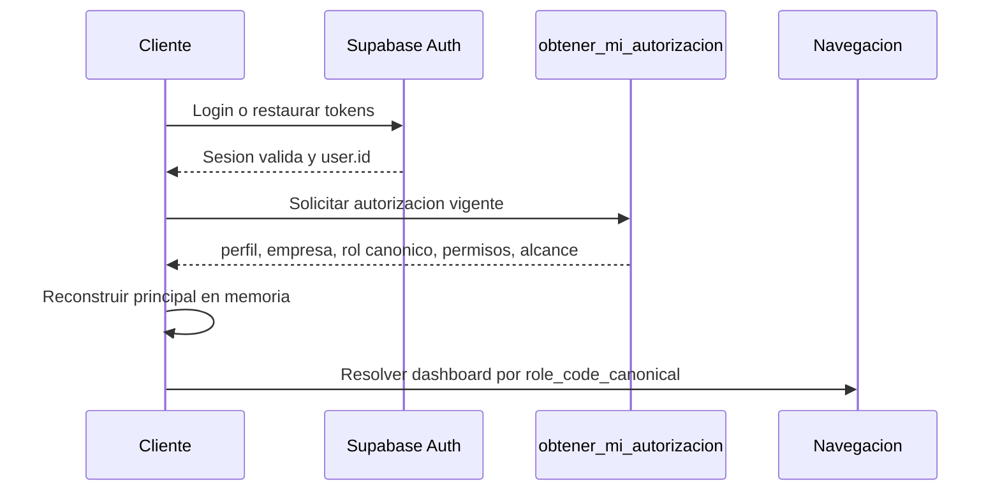
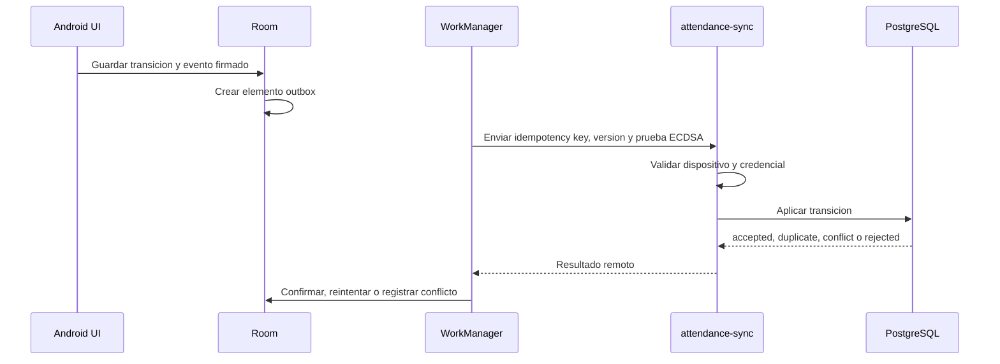
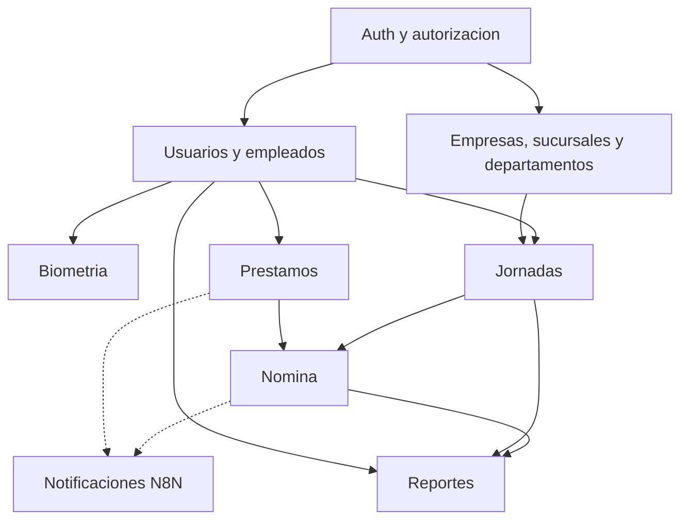

# ARQUITECTURA GENERAL

## 1. Vision

CONTROL HORARIO usa una arquitectura cliente-servidor con capacidad offline
en Android:

- Android ejecuta operacion de campo, kiosco, biometria y cola offline.
- Web ejecuta administracion, supervision y autoservicio.
- Supabase Auth identifica al usuario.
- PostgreSQL aplica contratos de negocio, autorizacion, alcance, auditoria y
  persistencia remota.
- Edge Functions encapsulan operaciones privilegiadas y flujos de dispositivo.
- N8N recibe eventos de integracion, sin ser fuente de verdad.

## 2. Diagrama de contexto

## 3. Capas y responsabilidades

| Capa | Responsabilidad | No debe hacer |
|---|---|---|
| UI Android/Web | Renderizar estado y emitir intenciones | Inventar permisos o alcance |
| Coordinacion de sesion | Restaurar Auth y cargar autorizacion | Persistir autorizacion como verdad |
| Repositorio/servicio cliente | Traducir contratos remotos | Duplicar reglas SQL |
| RPC PostgreSQL | Regla transaccional y consulta compuesta | Confiar en un rol enviado por cliente |
| RLS | Aislamiento por usuario, empresa y alcance | Ser reemplazada por filtros visuales |
| Edge Function | Operacion privilegiada validada | Exponer `service_role` al cliente |
| Room | Cache, cola offline y estado local necesario | Convertirse en autoridad remota |
| N8N | Orquestar notificaciones e integraciones | Modificar la verdad sin idempotencia |

## 4. Fuentes de verdad

| Concepto | Fuente de verdad | Copia permitida |
|---|---|---|
| Usuario Auth | `auth.users` | ID en memoria |
| Perfil | `public.profiles` | Principal en memoria |
| Empresa | Perfil/autorizacion remota | Principal en memoria |
| Rol | Roles y perfil en PostgreSQL | Original y canonico en memoria |
| Permisos | Asignaciones remotas | `Set<String>` en memoria |
| Departamentos | `perfil_departamentos` y autorizacion | IDs en memoria para UI |
| Sucursales | `perfil_sucursales` y autorizacion | IDs en memoria para UI |
| Empleado | `public.empleados` | Cache Android controlada |
| Jornada | Supabase tras sincronizar | Room mientras esta pendiente |
| Huella 2Connect | Plantilla local del dispositivo | No se considera dato remoto oficial |
| Rostro | Registro remoto y cache local cifrada | Embedding cifrado en Android |
| Nomina oficial | Registros del motor SQL | Reportes/exportaciones |
| Evento N8N | Evento de dominio original | Correlation ID temporal |

## 5. Flujo de autenticacion

Los tokens pueden persistir. Rol, permisos y alcance se vuelven a obtener del
servidor en cada bootstrap. El detalle esta en
[03_AUTENTICACION_Y_AUTORIZACION.md](./03_AUTENTICACION_Y_AUTORIZACION.md).

## 6. Flujo offline de jornadas Android

Room no reemplaza PostgreSQL. Es una frontera de continuidad operativa.

## 7. Flujo de operaciones privilegiadas

Las operaciones de administracion de usuarios, ciclo de vida de empleados y
sincronizacion de dispositivos pasan por Edge Functions:

1. El cliente envia JWT de usuario o credencial de dispositivo.
2. El handler valida identidad, empresa, permiso o dispositivo.
3. El handler usa la clave privilegiada solo dentro del runtime seguro.
4. PostgreSQL ejecuta la operacion y registra auditoria.
5. El cliente recibe un resultado funcional, no secretos internos.

## 8. Resolucion de dashboards

La normalizacion oficial ocurre en SQL. Cada cliente conserva un unico
resolver de presentacion:

| Rol canonico | Android | Web |
|---|---|---|
| `ADMIN` | DashboardAdministrador | Dashboard Ejecutivo |
| `SUPERVISOR` | DashboardSupervisor | Dashboard Supervisor |
| `EMPLEADO` | DashboardEmpleado | Portal/Dashboard Empleado |
| `RRHH` | DashboardRRHH | Portal generico actual |
| `NOMINA` | DashboardNomina | Portal generico actual |
| `AUDITOR` | DashboardAuditor | Portal generico actual |

La Web todavia no tiene dashboards dedicados para RRHH, NOMINA y AUDITOR.
Esta diferencia esta documentada como deuda, no como contrato final.

## 9. Limites de seguridad

- La clave anonima es publica por diseno y depende de RLS.
- `service_role` solo puede existir en backend o Edge Functions.
- El cliente no decide `company_id` efectivo sin validacion del servidor.
- El rol mostrado no concede permisos.
- La ausencia de un permiso es denegacion.
- El alcance visual no sustituye RLS.
- Toda accion sensible debe ser auditable.
- Los tokens y datos biometricos no se registran en logs.

## 10. Dependencias entre modulos

## 11. Desviaciones conocidas

La arquitectura objetivo ya esta definida, pero el codigo conserva:

- Autorizacion local especial para administrador en Web.
- Adaptacion local de alias de permisos en Web.
- Dos motores de nomina.
- Kiosco Web publico con datos mock.
- Navegacion Android concentrada en un archivo grande.
- Tokens visuales Android antiguos junto a los componentes OSINET actuales.
- N8N invocado desde el navegador sin cola durable.

Estas desviaciones no deben copiarse en codigo nuevo.

## 12. Regla para ampliar el sistema

Una nueva capacidad debe:

1. Identificar su fuente de verdad.
2. Definir permiso y alcance en servidor.
3. Definir contrato RPC o Edge solo si es necesario.
4. Mantener RLS.
5. Diseñar idempotencia para reintentos.
6. Exponer una unica decision de UI por plataforma.
7. Agregar auditoria cuando afecte personas, dinero o seguridad.
8. Actualizar estos documentos.
