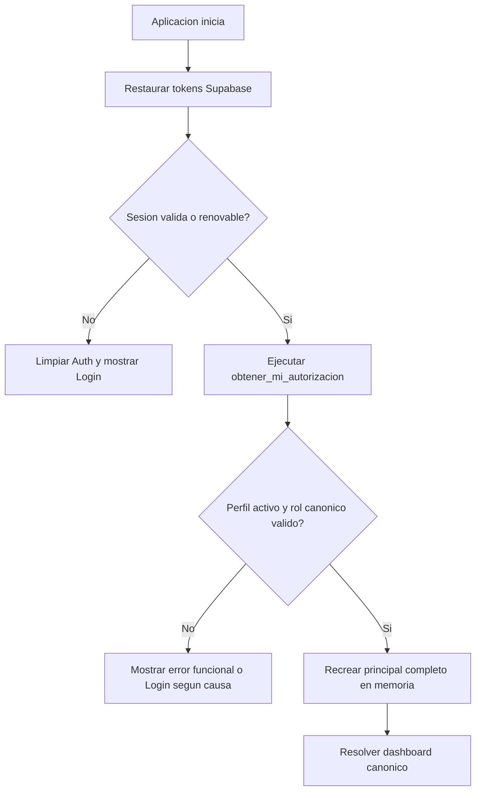

# AUTENTICACION Y AUTORIZACION

## 1. Principio central

Autenticacion y autorizacion son responsabilidades distintas:

- Supabase Auth confirma quien es el usuario y administra tokens.
- `public.obtener_mi_autorizacion()` confirma que puede hacer ahora.

Una sesion Auth valida no garantiza que el perfil siga activo, que conserve el
mismo rol o que tenga el mismo alcance.

## 2. Contrato remoto

El RPC central devuelve un objeto JSONB con los datos vigentes del usuario.
Los campos relevantes son:

| Campo JSON | Uso |
|---|---|
| `auth_user_id` | Identidad Supabase |
| `profile_id` | Perfil de aplicacion |
| `company_id` | Tenant actual |
| `employee_id` | Empleado asociado, cuando aplica |
| `email` | Correo vigente |
| `full_name` | Nombre de presentacion |
| `role_id` | Rol asignado |
| `role_code_original` | Codigo almacenado, solo diagnostico |
| `role_code_canonical` | Codigo oficial para navegacion |
| `role_name` | Etiqueta humana, nunca navegacion |
| `is_active` | Estado efectivo de la cuenta |
| `permission_codes` | Permisos efectivos |
| `department_ids` | Departamentos autorizados |
| `branch_ids` | Sucursales autorizadas |
| `authorization_version` | Version del contrato, cuando este disponible |

Los clientes deben tolerar la representacion JSON real definida por SQL sin
inventar campos alternativos.

## 3. Login

Flujo obligatorio:

1. Enviar credenciales exclusivamente a Supabase Auth.
2. Recibir la sesion oficial.
3. Obtener el usuario autenticado.
4. Ejecutar `obtener_mi_autorizacion()`.
5. Rechazar perfiles inexistentes, inactivos o sin rol canonico.
6. Construir un principal completo en memoria.
7. Resolver dashboard con `role_code_canonical`.
8. Navegar solo despues de completar los pasos anteriores.

No se guardan contrasenas.

## 4. Restauracion de sesion

Datos persistibles:

- `access_token`
- `refresh_token`
- `access_token_expires_at`

Datos que no son fuente persistente de autorizacion:

- rol original o canonico;
- nombre del rol;
- permisos;
- empresa;
- perfil;
- departamentos;
- sucursales;
- alcance;
- estado activo.

Flujo:

Un error temporal de red no debe borrar automaticamente tokens validos. El
cliente debe distinguir red, sesion invalida y cuenta desactivada.

## 5. Roles canonicos

| Codigo canonico | Significado |
|---|---|
| `ADMIN` | Administracion global dentro de su empresa |
| `SUPERVISOR` | Supervision por asignacion |
| `EMPLEADO` | Autoservicio y funciones del empleado |
| `RRHH` | Recursos humanos |
| `NOMINA` | Operacion de nomina |
| `AUDITOR` | Consulta y auditoria |

La migracion `0030` centraliza estos alias de empleado:

| Alias de entrada | Canonico |
|---|---|
| `empleado` | `EMPLEADO` |
| `empleados` | `EMPLEADO` |
| `employee` | `EMPLEADO` |
| `employees` | `EMPLEADO` |

`role_code_original` se conserva para diagnostico. No se usa para navegar ni
autorizar.

Android contiene una compatibilidad transitoria para los cuatro valores de
empleado. Debe permanecer hasta aplicar `0030`, pero SQL es la autoridad.

## 6. Principal autenticado

El principal en memoria debe contener como minimo:

- ID Auth;
- ID de perfil;
- ID de empresa;
- ID de empleado, cuando aplica;
- `roleCodeOriginal`;
- `roleCodeCanonical`;
- nombre de rol;
- permisos efectivos;
- sucursales;
- departamentos;
- estado activo.

Reemplazar el principal significa reemplazar todos sus campos. Nunca se mezcla
una autorizacion nueva con permisos o alcance de una sesion anterior.

## 7. Permisos

Reglas:

1. El servidor calcula los permisos efectivos.
2. El cliente recibe un conjunto de codigos.
3. Una pantalla exige uno o varios codigos explicitos.
4. La falta de permiso deniega.
5. Un rol no sustituye un permiso.
6. Un arreglo vacio no equivale a acceso permitido.
7. Un administrador no recibe bypass local; debe tener permisos remotos.

Ejemplos vigentes encontrados:

- `portal.acceder`
- `portal.ver_dashboard`
- `supervisor.dashboard`

Los nombres exactos de cada modulo deben provenir de las asignaciones
`permisos`, `rol_permisos` y `perfil_permisos`.

## 8. Alcance

El alcance de supervisor se obtiene de:

- asignacion de perfil;
- empresa;
- sucursales asignadas;
- departamentos asignados;
- estado activo de las asignaciones y entidades;
- permiso solicitado;
- RLS y validacion dentro del RPC.

Un supervisor:

- no tiene acceso global por su nombre de rol;
- puede tener varios departamentos;
- solo ve datos de sus departamentos activos asignados;
- recibe un mensaje funcional si no tiene asignaciones;
- no necesita permisos de administrador.

`public.departments` usa `is_active boolean`. No existe un contrato oficial
basado en `departments.status`.

## 9. Navegacion

Android debe enviar exclusivamente
`principal.roleCodeCanonical` a `DashboardResolver`.

Web debe enviar exclusivamente
`session.roleCodeCanonical` a su resolver de dashboard.

| Canonico | Destino Android | Destino Web actual |
|---|---|---|
| `ADMIN` | Administrador | Ejecutivo |
| `SUPERVISOR` | Supervisor | Supervisor |
| `EMPLEADO` | Empleado | Portal Empleado |
| `RRHH` | RRHH | Portal generico |
| `NOMINA` | Nomina | Portal generico |
| `AUDITOR` | Auditor | Portal generico |

`role_name` es solo presentacion. Un nombre como `SUPERVISOR ADMIN` no altera
el destino.

## 10. Cierre de sesion y desactivacion

Cerrar sesion:

1. Solicitar `signOut` a Supabase Auth.
2. Borrar tokens persistidos.
3. Limpiar principal en memoria.
4. Limpiar estado sensible de UI.
5. Navegar al login sin conservar back stack autenticado.

Cuenta desactivada:

1. Auth puede seguir teniendo tokens tecnicamente validos.
2. La autorizacion remota devuelve estado inactivo o rechaza el perfil.
3. El cliente limpia la sesion.
4. El cliente muestra Login con mensaje funcional.

## 11. Errores funcionales

Mensajes esperados:

| Causa | Mensaje |
|---|---|
| Sin departamentos | No tienes departamentos asignados. Contacta al administrador. |
| Sin permiso | Tu usuario no tiene permiso para consultar este dashboard. |
| Perfil inconsistente | No fue posible validar tu acceso. Cierra sesion e intentalo nuevamente. |
| Rol canonico ausente | No fue posible cargar la autorizacion del usuario. |
| Rol desconocido real | Rol no reconocido. |
| Red temporal | No fue posible conectar. Conservamos tu sesion para reintentar. |

Codigos PostgreSQL, stack traces y detalles internos se registran de forma
segura, no se muestran directamente.

## 12. Logs permitidos

Se pueden registrar:

- presencia de `user_id`, no su token;
- rol original y canonico;
- cantidad de permisos;
- cantidad de departamentos;
- destino seleccionado;
- nombre del RPC;
- codigo tecnico de error;
- resultado de alcance.

No se pueden registrar:

- access token;
- refresh token;
- contrasena;
- `service_role`;
- plantilla de huella;
- embedding facial;
- documento completo del empleado.

## 13. Implementacion actual por plataforma

### Android

- `SupabaseAuthApi` consume el RPC.
- `AuthRepository` construye el principal.
- `SessionCoordinator` restaura Auth y recarga autorizacion.
- `DashboardResolver` resuelve el canonico.
- `AppNavigation` navega al destino.

Estado: alineado con el contrato, con compatibilidad temporal de alias.

### Web

- Supabase JS persiste y renueva Auth.
- `authService` consulta el RPC.
- `AuthProvider` expone la sesion.
- Guards validan permisos.
- El resolver selecciona dashboard por rol canonico.

Estado: consume el contrato remoto, pero conserva tres desviaciones:

- bypass local para rol administrador;
- aliases locales de permisos;
- un guard de empleado que consulta valores originales.

No se debe extender ninguna de estas desviaciones.

## 14. Pruebas minimas

1. Login de cada rol canonico.
2. Restauracion de sesion de cada rol.
3. Cambio de rol con la misma sesion.
4. Desactivacion de cuenta.
5. Red temporal durante bootstrap.
6. Rol canonico nulo.
7. Permiso retirado con sesion existente.
8. Cambio de departamentos del supervisor.
9. Dos empresas con IDs diferentes.
10. Logout y limpieza completa.
