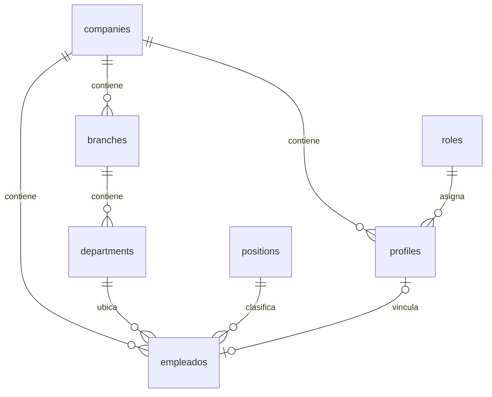

# BASE DE DATOS

## 1. Alcance

PostgreSQL en Supabase es la fuente remota de datos, autorizacion, alcance,
auditoria y resultados oficiales de negocio. Room es una base local Android y
se documenta por separado en [08_ANDROID.md](./08_ANDROID.md).

## 2. Convenciones

- Esquema principal: `public`.
- Identificadores principales: UUID.
- Tenant: `company_id`.
- Estado booleano: preferir `is_active`.
- Tiempo: `timestamptz`.
- Operaciones sensibles: auditoria.
- Acceso de clientes: RLS y funciones controladas.
- Cambios de esquema: migracion nueva e inmutable.

La tabla `public.departments` tiene:

| Columna | Tipo |
|---|---|
| `id` | `uuid` |
| `company_id` | `uuid` |
| `branch_id` | `uuid` |
| `name` | `text` |
| `code` | `text` |
| `description` | `text` |
| `is_active` | `boolean` |
| `created_at` | `timestamptz` |
| `updated_at` | `timestamptz` |

No se debe volver a asumir `departments.status`.

## 3. Dominios principales

### Organizacion e identidad

- `companies`
- `branches`
- `departments`
- `positions`
- `profiles`
- `roles`
- `empleados`

Relaciones principales:



### Autorizacion y alcance

- `permisos`
- `rol_permisos`
- `perfil_permisos`
- `perfil_sucursales`
- `perfil_departamentos`
- `user_provisioning_audit`

Los permisos efectivos combinan asignaciones autorizadas por el contrato SQL.
El cliente no reconstruye esta union.

### Dispositivos y biometria

- `empleado_biometrias`
- `empleado_biometria_auditoria`
- `dispositivos_android`
- `codigos_enrolamiento_dispositivo`
- `credenciales_dispositivo`
- `dispositivo_auditoria`
- `face_first_enrollment_audit`

### Jornadas

- `jornadas`
- `jornada_eventos`
- `jornada_incidencias`
- `jornada_conflictos`
- `jornada_auditoria`
- `jornada_ganancias`
- `horarios_empleados`
- `notificaciones_internas`
- `supervisor_auditoria`

### Nomina

- `nomina_periodos`
- `nominas`
- `nomina_detalles`
- `nomina_reglas`
- `nomina_reglas_empleado`
- `nomina_ajustes`
- `nomina_prestamos`
- `nomina_creditos`
- `nomina_descuentos`
- `nomina_archivos`
- `nomina_auditoria`

### Prestamos del portal

- `prestamo_solicitudes`
- `prestamo_movimientos`
- `prestamo_solicitud_auditoria`

### Administracion, sincronizacion y configuracion

- `administracion_auditoria`
- `employee_upload_idempotency`
- `company_settings`
- registros y secuencias de codigo de empleado;
- auditoria del ciclo de vida del empleado.

## 4. Migraciones

Las migraciones `0001` a `0029` estaban presentes en remoto al 2026-07-27.
`0030` solo estaba local.

### Base historica

`0001` a `0013` forman la base incremental de organizacion, usuarios,
autorizacion, jornadas, supervision, nomina, portal y administracion. Son
historicas e inmutables. El SQL de cada archivo es el contrato exacto cuando
se investigue un objeto de esa etapa.

### Evolucion reciente

| Migracion | Objetivo |
|---|---|
| `0014` | Sucursales, prueba biometrica, ganancias y ventana de correccion |
| `0015` | Asignacion explicita de permisos al administrador |
| `0016` | Guardas para desactivacion de roles |
| `0017` | Idempotencia de carga de empleados |
| `0018` | Embedding facial remoto |
| `0019` | Total del dashboard de nomina |
| `0020` | Piso neto, descuentos y conflicto remoto |
| `0021` | Configuracion facial de kiosco |
| `0022` | Gestion interna de accesos y tombstone de perfil |
| `0023` | Primer enrolamiento facial y auditoria |
| `0024` | Codigos de empleado de seis digitos y registros |
| `0025` | Retiro de autenticacion por PIN |
| `0026` | Terminacion/reactivacion de empleados |
| `0027` | Solo empleados activos disponibles para acceso |
| `0028` | Normalizacion y alcance de supervisor |
| `0029` | Autenticacion/autorizacion unificada |
| `0030` | Canonicalizacion de aliases de empleado |

## 5. Regla de migracion

1. Nunca editar una migracion aplicada.
2. Crear el siguiente numero secuencial.
3. Usar `CREATE OR REPLACE FUNCTION` cuando se corrija una funcion.
4. Hacer el cambio idempotente cuando sea razonable.
5. Verificar nombres y tipos contra el esquema real.
6. Revisar RLS, grants, dependencias y funciones consumidoras.
7. Aplicar primero en un entorno controlado.
8. Registrar el resultado real del `db push`.
9. Actualizar [CHANGELOG.md](./CHANGELOG.md).

## 6. RPC central de autorizacion

`public.obtener_mi_autorizacion()`:

- deriva el usuario desde `auth.uid()`;
- valida perfil y empresa;
- obtiene rol original y canonico;
- calcula permisos efectivos;
- obtiene sucursales y departamentos;
- devuelve estado activo;
- no confia en un rol enviado por el cliente.

La migracion `0029` establece el contrato unificado. La migracion `0030`
corrige los aliases `empleado`, `empleados`, `employee` y `employees`.

## 7. Otros contratos funcionales

El esquema contiene funciones para:

- acceso y provision de usuarios;
- alta y ciclo de vida de empleados;
- portal del empleado;
- dashboard y alcance de supervisor;
- transiciones y correcciones de jornadas;
- periodos, calculo, ajustes y cierre de nomina;
- prestamos y movimientos;
- administracion organizacional;
- enrolamiento y sincronizacion de dispositivos.

Antes de cambiar una llamada se debe inspeccionar la firma SQL exacta. No se
debe inferir la forma del resultado desde TypeScript o Kotlin.

## 8. RLS

RLS debe permanecer habilitada en tablas expuestas. Las politicas combinan:

- usuario autenticado;
- empresa;
- perfil activo;
- permiso;
- sucursal o departamento;
- relacion del empleado consigo mismo;
- operacion solicitada.

Pruebas obligatorias para una politica:

1. Usuario correcto en empresa correcta.
2. Usuario de otra empresa.
3. Supervisor con departamento asignado.
4. Supervisor sin departamento.
5. Supervisor con otro departamento.
6. Empleado consultando sus propios datos.
7. Empleado consultando datos ajenos.
8. Perfil inactivo.
9. Permiso retirado.
10. Acceso anonimo.

## 9. Triggers y auditoria

Los triggers y funciones relacionadas protegen:

- codigo unico de empleado;
- limpieza de autorizacion al cambiar rol;
- consistencia del ciclo de vida;
- eventos y conflictos de jornada;
- movimientos de nomina y prestamos;
- cambios administrativos;
- enrolamiento y cambios biometricos.

No se debe omitir auditoria para operaciones de identidad, dinero, jornadas,
alcance o biometria.

## 10. Integridad multiempresa

Toda consulta funcional debe mantener `company_id` de extremo a extremo. Un ID
recibido del cliente no es suficiente: el servidor debe confirmar que pertenece
a la empresa efectiva del usuario o dispositivo.

Las claves foraneas, filtros, funciones y RLS deben coincidir. Filtrar solo en
la UI es un error de seguridad.

## 11. Datos sensibles

- No guardar contrasenas de aplicacion.
- `pin_hash` es legado deprecado y no debe reactivarse.
- No exponer `service_role`.
- No devolver plantillas biometricas a clientes no autorizados.
- No registrar payloads completos de empleados.
- Mantener timestamps y actor en auditorias.

## 12. Estado pendiente

Accion inmediata:

```powershell
supabase db push --linked
```

Ese comando debe aplicar `0030` solo despues de revisar el proyecto vinculado y
el plan de migracion. El resultado no se considera completado hasta comprobar
que:

- remoto lista `0030`;
- `role_code_original = empleados` se conserva;
- `role_code_canonical = EMPLEADO`;
- Android y Web resuelven Dashboard Empleado.
