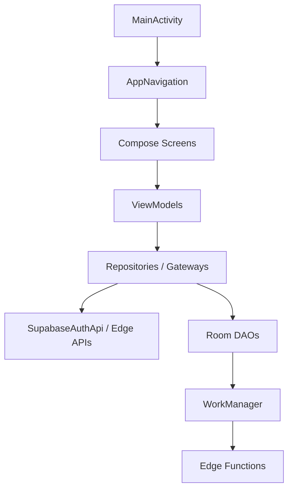

# ANDROID

## 1. Proposito

La aplicacion Android cubre operacion de campo, kiosco, marcacion, biometria,
sincronizacion offline y dashboards por rol.

Modulo Gradle:

- `:app`
- namespace: `com.example.controlhorario`
- application ID: `com.example.controlhorario`
- min SDK: 28
- target SDK: 36
- compile SDK: 36.1

## 2. Tecnologias

- Kotlin
- Jetpack Compose
- Navigation Compose
- ViewModel/coroutines
- Room
- WorkManager
- Supabase REST/Auth mediante la capa API del proyecto
- Android BiometricPrompt
- CameraX
- ML Kit Face Detection
- TensorFlow Lite
- Android Keystore
- SDK propietario 2Connect/FPLib

## 3. Estructura logica



Regla:

- un Composable no consulta Supabase directamente;
- un ViewModel coordina estado de UI;
- un repositorio/gateway traduce contratos;
- Room conserva cache y trabajo pendiente;
- WorkManager sincroniza.

## 4. Inicio de aplicacion

`MainActivity`:

- inicializa la coordinacion de sesion;
- inicializa modo kiosco;
- programa sincronizaciones;
- restaura lock task/estado inmersivo;
- controla el boton atras cuando kiosco esta activo.

La ruta de bootstrap decide entre:

- Login;
- error de autorizacion recuperable;
- dashboard autenticado;
- restauracion de kiosco.

No se debe mostrar Login mientras todavia se restaura una sesion valida.

## 5. Sesion

Componentes relevantes:

- `SupabaseAuthApi`
- `AuthRepository`
- `AuthSessionStore`
- `SessionCoordinator`
- `UserSessionManager`
- `AuthenticatedPrincipal`

Flujo:

1. Restaurar access/refresh token.
2. Renovar cuando corresponda.
3. Validar usuario Auth.
4. Ejecutar `obtener_mi_autorizacion()`.
5. Crear un principal nuevo.
6. Reemplazar estado en memoria.
7. Resolver dashboard.

La persistencia `osinet_session` contiene solo material de Auth y expiracion.
No se usa un rol persistido para navegar.

## 6. Roles y navegacion

`DashboardResolver` es el unico traductor del rol canonico a destino Android.

| Entrada | Destino |
|---|---|
| `ADMIN` | `DashboardDestination.ADMIN` |
| `SUPERVISOR` | `DashboardDestination.SUPERVISOR` |
| `EMPLEADO` | `DashboardDestination.EMPLOYEE` |
| `RRHH` | `DashboardDestination.HR` |
| `NOMINA` | `DashboardDestination.PAYROLL` |
| `AUDITOR` | `DashboardDestination.AUDITOR` |

Compatibilidad temporal:

- `EMPLEADOS`
- `EMPLOYEE`
- `EMPLOYEES`

Los cuatro valores de empleado resuelven a `EMPLOYEE`. Esta proteccion evita
fallos mientras `0030` no esta en remoto, pero no reemplaza la correccion SQL.

No usar:

- `roleName`;
- `roleCodeOriginal`;
- `AppUserEntity.role`;
- normalizacion nueva en otra clase.

## 7. Grafo de navegacion

`AppNavigation.kt` concentra rutas para:

- enrolamiento;
- bootstrap y login;
- kiosco;
- marcacion facial/huella;
- dashboard supervisor;
- home y dashboards;
- empleados;
- accesos;
- sincronizacion;
- documentos y nomina;
- jornadas;
- permisos;
- sucursales/departamentos;
- configuracion;
- reportes;
- vacaciones;
- prestamos;
- incidencias.

Riesgo:

- el archivo es grande y una modificacion puede afectar rutas no relacionadas.

Regla:

- no agregar un segundo router de roles;
- no resolver dashboard dentro de una pantalla;
- no usar un dashboard administrativo como fallback.

## 8. Autorizacion de UI

La politica Android consume permisos remotos.

Comportamiento actual:

- supervisor: requiere `supervisor.dashboard`;
- empleado: requiere al menos una capacidad `empleado.*`;
- admin, RRHH, NOMINA y AUDITOR: usan el contrato de portal vigente;
- rol desconocido: denegado.

No hay bypass administrativo en la politica Android actual.

La UI puede ocultar modulos, pero la API/RPC/RLS debe validar de nuevo.

## 9. Room

Base:

- `AppDatabase`
- version 39
- migraciones explicitas
- sin fallback destructivo

Dominios locales:

- empleados;
- empresa/configuracion;
- sucursales/departamentos;
- usuarios;
- horarios/calendario;
- jornadas/eventos/outbox/conflictos;
- nomina/configuracion/historial;
- documentos;
- prestamos;
- permisos solicitados;
- licencias medicas;
- vacaciones;
- biometria;
- supervisores;
- enrolamiento de dispositivos;
- configuracion de kiosco.

Migraciones locales recientes:

| Version | Cambio |
|---|---|
| 26 a 27 | IDs remotos y enrolamiento |
| 27 a 28 | Metadatos remotos de empleado |
| 28 a 29 | Jornadas, outbox y conflictos |
| 29 a 30 | Horarios |
| 30 a 31 | Email de usuario |
| 31 a 32 | Sucursal en jornada |
| 32 a 33 | Biometria facial |
| 33 a 34 | Outbox de carga de empleado |
| 34 a 35 | Configuracion de kiosco |
| 35 a 36 | Company ID |
| 36 a 37 | Normalizacion de codigo de empleado |
| 37 a 38 | Retiro de PIN legado |
| 38 a 39 | Retiro de password local |

No se debe usar migracion destructiva para ocultar una incompatibilidad.

## 10. Jornadas offline

Contrato local:

- estados: `SIN_INICIAR`, `EN_CURSO`, `EN_PAUSA`, `FINALIZADA`;
- acciones: `INICIAR`, `PAUSAR`, `REANUDAR`, `FINALIZAR`.

Cada mutacion relevante conserva:

- ID de evento;
- idempotency key;
- version conocida;
- timestamp;
- actor/dispositivo;
- prueba biometrica;
- firma ECDSA;
- estado de sincronizacion.

Resultados remotos:

- accepted;
- duplicate;
- conflict;
- rejected.

Un conflicto no se sobreescribe silenciosamente. Se registra y sigue el flujo
de resolucion definido.

## 11. WorkManager

Responsabilidades:

- sincronizacion de jornadas;
- descarga de empleados/configuracion;
- subida de empleados creados offline;
- reintentos con backoff;
- continuidad despues de cierre/reinicio.

Reglas:

- trabajo unico cuando aplique;
- input pequeno;
- datos grandes en Room;
- idempotencia de servidor;
- no asumir ejecucion inmediata;
- diferenciar fallo permanente y transitorio.

## 12. Identidad de dispositivo y kiosco

`DeviceIdentityManager` usa:

- clave EC en Android Keystore para firma;
- clave AES-GCM para proteger credencial;
- identificador de instalacion/dispositivo;
- almacenamiento privado de metadatos.

`KioskModeManager`:

- persiste modo;
- entra en lock task cuando el dispositivo esta autorizado;
- restaura al reiniciar;
- exige salida controlada.

Manifest:

- camara;
- biometria;
- Internet/estado de red;
- boot completed;
- USB host;
- Device Admin receiver;
- Boot receiver;
- `singleTask`;
- cleartext deshabilitado.

## 13. Reconocimiento facial

Pipeline:

1. CameraX obtiene imagen.
2. ML Kit detecta/corta rostro.
3. FaceNet recibe imagen RGB de 160x160.
4. TFLite genera embedding de 128 dimensiones.
5. El motor compara similitud coseno.
6. La politica exige muestras consecutivas y margen de ambiguedad.
7. El resultado autoriza el siguiente paso funcional.

El archivo `facenet.tflite` es un asset local. Los embeddings locales se
cifran con Android Keystore/AES-GCM.

Limitacion critica:

- no existe liveness ni presentacion-attack detection.

## 14. Huella 2Connect

El SDK se integra mediante `app/libs/fplib-reader-v3.jar`.

El manager externo:

- mantiene instancia por proceso;
- detecta USB;
- abre/cierra lector;
- captura;
- enrola;
- compara;
- guarda plantilla local mediante Room.

El umbral actual depende del score del SDK. No debe cambiarse sin un conjunto
de pruebas fisicas.

No confundir:

- huella 2Connect;
- BiometricPrompt del sistema;
- reconocimiento facial.

Son tres mecanismos distintos.

## 15. Nomina Android

Existen motores locales y exportacion PDF/CSV. Esta implementacion no es la
autoridad financiera.

Regla vigente:

- el resultado oficial es el persistido en Supabase por el motor SQL;
- no agregar reglas nuevas solo al motor Android;
- una vista local debe identificarse como estimacion si no esta sincronizada.

## 16. Seguridad

- TLS obligatorio.
- Cleartext deshabilitado.
- Tokens en almacenamiento privado.
- Claves en Keystore.
- Embeddings cifrados.
- `service_role` prohibido.
- Logs sin tokens ni biometria.
- Firma de eventos de dispositivo.
- Credenciales revocables.
- RLS y validacion remota incluso si la UI oculta la accion.

## 17. Compilacion y pruebas

Desde la raiz:

```powershell
.\gradlew.bat :app:testDebugUnitTest
.\gradlew.bat :app:assembleDebug
.\gradlew.bat :app:lintDebug
```

Ultima evidencia: los tres comandos terminaron correctamente el 2026-07-27.

Pruebas manuales necesarias:

- cambio de rol con la misma sesion;
- cuenta desactivada;
- inicio sin red;
- reinicio durante jornada;
- conflicto de jornada;
- boot en modo kiosco;
- desconexion/reconexion USB;
- rostro ambiguo;
- dispositivo revocado.

## 18. Deudas Android

- Navegacion monolitica.
- Motor de nomina duplicado.
- Sin liveness facial.
- Matriz 2Connect incompleta.
- Tokens visuales antiguos junto al sistema OSINET.
- Algunos mensajes mezclan huella y rostro.
- Cobertura E2E limitada para modo offline/hardware.

Estas deudas no autorizan una refactorizacion amplia dentro de una correccion
puntual.
