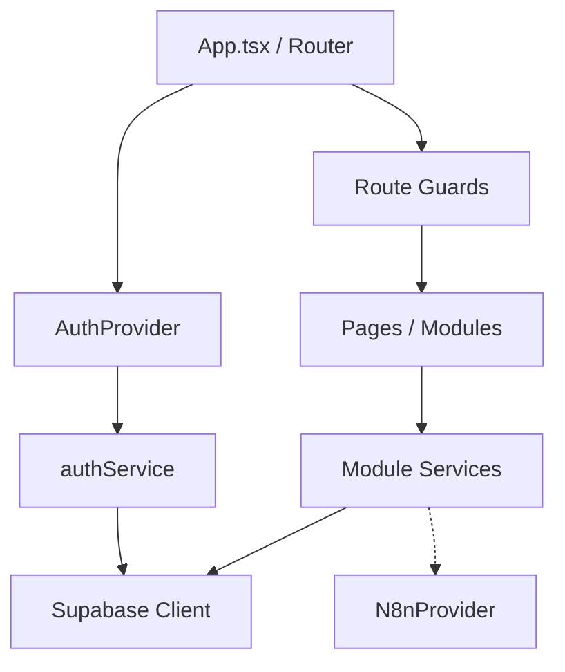

# WEB

## 1. Proposito

La aplicacion Web cubre administracion, supervision, autoservicio, jornadas,
nomina, prestamos, reportes y configuracion.

Directorio:

- `web/`

Salida de build:

- `web/dist/`

## 2. Tecnologias

- React
- TypeScript
- Vite
- React Router
- Supabase JS
- Lucide
- jsPDF
- XLSX

La mayoria de dependencias del `package.json` usa actualmente `latest`. Esto es
una deuda de reproducibilidad. Las nuevas dependencias deben fijar version.

## 3. Estructura logica



Reglas:

- `AuthProvider` mantiene estado de UI;
- `authService` hidrata autorizacion;
- guards controlan entrada;
- los servicios consumen contratos;
- el servidor vuelve a validar.

## 4. Rutas

Rutas publicas:

- `/`
- `/login`
- `/bootstrap`
- recuperacion/cambio de contrasena;
- `/kiosco`.

Rutas protegidas:

- `/dashboard`
- portal del empleado;
- empleados;
- accesos;
- jornadas;
- incidencias;
- nomina;
- prestamos;
- organizacion;
- administracion;
- dispositivos;
- reportes.

`/kiosco` usa datos mock en el estado actual. No debe presentarse como ruta
productiva.

`vercel.json` reescribe rutas hacia la SPA para soportar refresh directo.

## 5. Supabase client

Configuracion vigente:

- `persistSession: true`
- `autoRefreshToken: true`
- `detectSessionInUrl: true`

Los tokens son administrados por Supabase JS. La aplicacion no debe guardar una
segunda sesion manual con rol y permisos.

Variables esperadas:

- `VITE_SUPABASE_URL`
- `VITE_SUPABASE_ANON_KEY`

Las variables `VITE_*` son publicas en el bundle. Nunca contienen
`service_role`.

## 6. Autorizacion Web

`authService`:

1. obtiene sesion Supabase;
2. ejecuta `obtener_mi_autorizacion()`;
3. tipa la respuesta;
4. construye sesion con rol original/canonico;
5. conserva permisos y empresa en memoria.

`AuthProvider` rehidrata en:

- login;
- carga inicial;
- `SIGNED_IN`;
- `TOKEN_REFRESHED`;
- `USER_UPDATED`.

Permiso oficial de `/dashboard`:

- `portal.ver_dashboard`

No usar:

- `dashboard.view`;
- permiso vacio;
- rol como sustituto de permiso.

## 7. Desviaciones actuales de autorizacion

La Web aun contiene:

- bypass local cuando el rol parece administrador;
- adaptador de aliases `.view`/`.ver`;
- normalizacion local de roles;
- guard de empleado que consulta valores originales;
- posibilidad estructural de permitir una lista requerida vacia.

Estas ramas son deuda. No se deben copiar ni extender. La direccion oficial es:

- rol canonico remoto para seleccion;
- permisos remotos exactos para acceso;
- RLS/RPC para alcance.

## 8. Dashboard por rol

La ruta `/dashboard` monta primero un resolver y luego el componente correcto.

| Rol canonico | Componente actual |
|---|---|
| `ADMIN` | Dashboard Ejecutivo/Administrador |
| `SUPERVISOR` | Dashboard Supervisor |
| `EMPLEADO` | Portal/Dashboard Empleado |
| `RRHH` | Portal generico |
| `NOMINA` | Portal generico |
| `AUDITOR` | Portal generico |

El resolver tambien tolera `EMPLEADOS` mientras el servidor remoto no tenga
`0030`.

No se deben mezclar:

- permiso para entrar;
- rol para elegir dashboard;
- permiso interno de cada modulo.

Un rol valido nunca debe montar primero el dashboard administrativo para luego
fallar.

## 9. Navegacion y menu

El menu debe usar los mismos permisos oficiales que las rutas.

Reglas:

- el enlace a `/dashboard` usa `portal.ver_dashboard`;
- ocultar un enlace no concede ni revoca acceso;
- una ruta siempre tiene guard;
- los modulos del dashboard usan permisos propios;
- administrador no recibe menu completo por bypass local en la arquitectura
  final.

## 10. Modulos

### Empleados

- alta/edicion;
- codigo de seis digitos;
- terminacion/reactivacion;
- sincronizacion y auditoria;
- `employee-management`.

### Accesos

- listado de candidatos;
- creacion de usuario;
- acciones de provision;
- `user-provisioning`;
- empleados activos.

### Jornadas

- filtros;
- indicadores;
- tabla en escritorio;
- tarjetas en movil;
- estados;
- trabajo/pausa;
- acciones por permiso;
- carga, error y vacio.

La duracion usa una utilidad reutilizable y no cambia los minutos persistidos.

### Supervisor

- metricas y empleados por alcance;
- auditoria;
- mensajes funcionales sin asignaciones.

### Nomina

- periodos;
- calculo;
- ajustes;
- estados;
- prestamos/creditos;
- exportaciones;
- dashboard.

### Portal empleado

- autorizacion remota;
- modulos visibles por permiso;
- datos personales permitidos;
- solicitudes de prestamo.

### Organizacion/administracion

- empresas;
- sucursales;
- departamentos;
- asignaciones;
- configuracion;
- dispositivos.

### Reportes

- consultas reales en modulos disponibles;
- exportaciones;
- algunas ramas parciales o de solo lectura.

## 11. UI

Estilo:

- fondo oscuro azul;
- superficies elevadas;
- DM Sans;
- Manrope;
- badges semanticos;
- skeletons;
- breakpoints principales alrededor de 1100 y 760 px;
- soporte `prefers-reduced-motion`.

Referencia:
[06_UI_UX_GUIDE.md](./06_UI_UX_GUIDE.md).

## 12. N8N

La Web contiene `N8nProvider`.

Variables:

- `VITE_N8N_BASE_URL`
- timeout configurable, valor actual por defecto 8000 ms;
- reintentos configurables, valor actual por defecto 2.

Endpoint:

`POST {baseUrl}/webhook/erp-notifications`

Cabecera:

- `X-Request-Id`

La notificacion no bloquea la operacion de dominio. El detalle y los riesgos
estan en [11_N8N.md](./11_N8N.md).

## 13. Build

```powershell
cd web
pnpm install
pnpm run build
```

El script de build ejecuta TypeScript y Vite. `pnpm install` solo es necesario
cuando cambian dependencias o falta el entorno.

Esta auditoria documental no repitio el build Web. Un cambio Web debe reportar
el resultado real de `pnpm run build`.

## 14. Despliegue

Destino previsto:

- Vercel;
- SPA con rewrite;
- variables de entorno por proyecto.

Antes de desplegar:

1. confirmar proyecto Vercel;
2. confirmar branch/revision;
3. configurar Supabase URL/anon key;
4. configurar N8N solo si el endpoint esta aprobado;
5. ejecutar build;
6. probar login y refresh directo;
7. verificar rutas protegidas;
8. verificar rol y permiso remoto.

## 15. Seguridad

- No `service_role`.
- No secretos en `VITE_*`.
- No autorizacion solo por menu.
- No datos de otra empresa en cache.
- No errores SQL en UI.
- Sanitizar/validar exportaciones.
- RLS para consultas directas.
- Edge Function para operacion privilegiada.
- `noopener` y destino seguro en enlaces externos.

## 16. Pruebas minimas

1. Login y logout.
2. Restauracion despues de refresh.
3. Cambio de rol con sesion.
4. Cuenta desactivada.
5. `/dashboard` por cada rol.
6. Permiso retirado.
7. Supervisor con/sin departamentos.
8. Navegacion directa a ruta protegida.
9. Vista 360, 768 y escritorio.
10. Carga/error/vacio.
11. Empresa A contra empresa B.
12. Build de produccion.

## 17. Deudas Web

- Bypass administrativo local.
- Aliases locales de permisos.
- Guard de empleado basado en valor original.
- RRHH/NOMINA/AUDITOR sin dashboard dedicado.
- `/kiosco` mock en rutas publicas.
- Dependencias con `latest`.
- N8N llamado desde navegador.
- Provider de notificaciones de eventos sin implementacion efectiva.

No se debe resolver una deuda agregando una tercera variante de la misma
logica.
