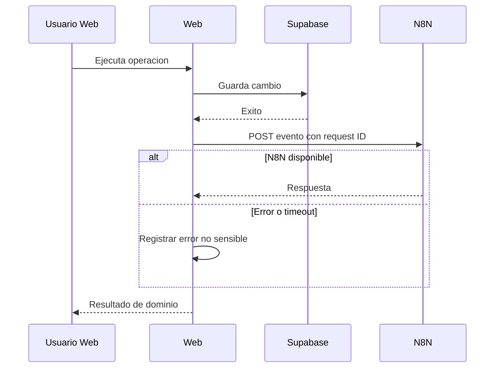
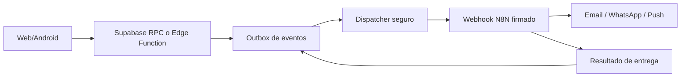

# N8N

## 1. Estado real

Estado: base implementada, no subsistema completo.

El repositorio contiene un adaptador Web para enviar eventos a N8N. No contiene:

- exportaciones JSON de workflows;
- configuracion de credenciales N8N;
- definicion de nodos;
- despliegue automatizado;
- cola durable;
- auditoria de entrega;
- evidencia de instancia productiva.

Por lo tanto, no se debe afirmar que WhatsApp, email, push o webhook esten
operativos solo porque existen tipos en TypeScript.

## 2. Integracion actual

Componente:

- `N8nProvider` en Web.

Endpoint:

```text
POST {VITE_N8N_BASE_URL}/webhook/erp-notifications
```

Cabecera:

```text
X-Request-Id: <correlation-id>
```

Comportamiento:

- timeout por defecto: 8000 ms;
- reintentos por defecto: 2;
- conjunto en memoria para evitar reenvio de un correlation ID durante la
  sesion;
- error capturado para no bloquear la transaccion principal;
- canales tipados: `whatsapp`, `email`, `webhook`, `push`;
- canal usual actual: `webhook`.

## 3. Eventos conectados

Se encontraron hooks para:

- cambio de departamento;
- cambio de supervisor;
- nomina generada;
- prestamo aprobado;
- prestamo rechazado;
- empleado desactivado.

La operacion de dominio ocurre primero. La notificacion es secundaria.

## 4. Flujo actual



## 5. Limitaciones

- La llamada sale del navegador.
- `VITE_N8N_BASE_URL` queda visible en el bundle.
- La deduplicacion es solo en memoria.
- Un refresh pierde el conjunto de IDs enviados.
- No existe firma HMAC documentada.
- No hay persistencia de eventos pendientes.
- No hay dead-letter queue.
- No hay reintento despues de cerrar la pagina.
- No hay estado de entrega por destinatario.
- No hay workflows versionados junto al codigo.

## 6. Seguridad

La integracion actual no debe enviar:

- access token;
- refresh token;
- service role;
- contrasena;
- embedding facial;
- plantilla de huella;
- documento completo del empleado;
- informacion financiera no necesaria.

Un webhook publico debe:

- validar firma o secreto fuera del bundle;
- limitar origen/metodo;
- validar esquema;
- aplicar rate limit;
- usar idempotency key;
- registrar correlation ID;
- rechazar replay;
- minimizar datos.

Como `VITE_*` es publico, un secreto real no puede permanecer en Web.

## 7. Arquitectura objetivo

La integracion recomendada es de servidor:



Caracteristicas:

- outbox transaccional;
- payload versionado;
- idempotencia persistente;
- firma;
- reintentos con backoff;
- dead-letter;
- auditoria;
- datos minimos;
- monitoreo.

Esta arquitectura es una meta, no una capacidad ya implementada.

## 8. Contrato de evento recomendado

```json
{
  "event_id": "uuid",
  "event_type": "payroll.generated",
  "event_version": 1,
  "company_id": "uuid",
  "occurred_at": "ISO-8601",
  "correlation_id": "uuid",
  "actor_type": "user|system",
  "payload": {}
}
```

Reglas:

- `event_id` unico;
- `event_type` estable;
- version explicita;
- `company_id` validado en servidor;
- payload minimo;
- no PII innecesaria.

## 9. Variables

Actuales en Web:

- `VITE_N8N_BASE_URL`
- timeout de integracion;
- cantidad de reintentos.

Futuras variables de secreto deben vivir en:

- secretos de Edge Function;
- entorno seguro del dispatcher;
- credenciales de N8N.

Nunca en `VITE_*`.

## 10. Operacion

Antes de habilitar N8N en produccion:

1. Versionar workflows o documentar su repositorio oficial.
2. Definir propietarios.
3. Definir endpoint por entorno.
4. Implementar autenticacion.
5. Probar idempotencia.
6. Probar timeout y reintento.
7. Probar datos invalidos.
8. Probar canal caido.
9. Configurar alertas.
10. Definir retencion de logs.

## 11. Criterio de terminado

N8N solo puede marcarse operativo cuando exista evidencia de:

- workflow desplegado;
- contrato versionado;
- autenticacion del webhook;
- evento persistente;
- reintento durable;
- entrega o fallo auditable;
- prueba por canal;
- monitoreo;
- documentacion de recuperacion.

Hasta entonces, permanece como `Base implementada`.
