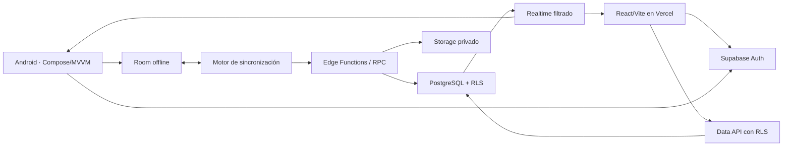

# Arquitectura general de CONTROLHORARIO

## Decisión principal

Supabase PostgreSQL será la fuente central de verdad. Room seguirá siendo la base local operativa de Android para funcionamiento offline; no será una segunda autoridad independiente. La web consume Supabase y Android sincroniza por contratos versionados.

## Android

- Kotlin, Jetpack Compose, MVVM, Repository y Room.
- Kiosco con PIN y biometría Android/2Connect; GPS y dispositivo se registran como evidencia.
- UUID generados en dispositivo para eventos offline; WorkManager ejecutará sincronización incremental.
- Room conserva datos mínimos necesarios para operar sin red. Salarios globales, documentos privados, secretos y permisos de otros usuarios no se descargan.
- Los eventos de asistencia sincronizados son inmutables; toda corrección crea registros nuevos.

## Web

- React, TypeScript, Vite y Vercel.
- Supabase Auth sustituirá el login/localStorage demostrativo.
- Menú derivado de permisos efectivos; RLS sigue siendo la autorización real.
- Administración de empleados, horarios, asistencia, solicitudes, reportes y nómina.
- Operaciones sensibles llaman Edge Functions/RPC; nunca usan credenciales privilegiadas en el navegador.

## Supabase

- PostgreSQL 17: fuente central, integridad, RLS, auditoría y estados transaccionales.
- Auth: identidad, recuperación, sesiones y MFA futuro; no almacena rol/empresa desde metadata de cliente.
- Storage: binarios privados; PostgreSQL guarda metadatos y relaciones.
- Realtime: eventos operativos seleccionados y siempre filtrados por empresa.
- Edge Functions: aprovisionamiento, PIN, asistencia, correcciones, nómina, exportaciones y revocación.

## Límites de responsabilidad

| Capa | Responsabilidad |
|---|---|
| PostgreSQL | Integridad, tenant, estados válidos, idempotencia, RLS y auditoría durable. |
| Edge/RPC | Autorización sensible, transacciones multi-tabla, archivos y cálculos controlados. |
| Web | Presentación, validación inmediata y ocultación de opciones según permisos. |
| Android | Captura offline, biometría local, GPS, cola y UX de kiosco. |
| Room | Caché operativa y outbox; nunca autoridad final después de sincronizar. |

## Multiempresa

Toda tabla empresarial lleva `empresa_id` (o `company_id` en objetos ya ejecutados). Las FKs compuestas impiden cruces de tenant. `global` queda reservado para `super_admin` operado desde backend; un usuario normal nunca elige empresa en una petición.

## Fechas y zonas horarias

- Instantes: `timestamptz` en UTC (`created_at`, eventos, auditoría).
- Fechas civiles: `date` (feriados, vacaciones).
- Horas planificadas: `time` + zona horaria de empresa/sucursal.
- Turnos nocturnos modelan día de inicio y permiten fin al día siguiente.

## Estado actual y transición

Android contiene modelos locales previos con `Int` autogenerado y campos sensibles legados. No se cambian en esta fase. Antes de sincronizar se introducirán UUID remotos, adaptadores y migraciones Room. La web continúa con datos demo hasta integrar Supabase.
