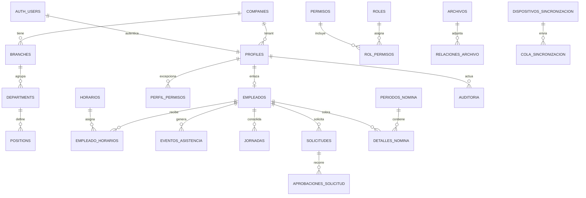
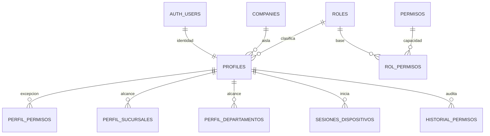
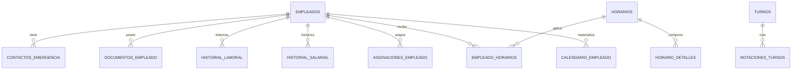
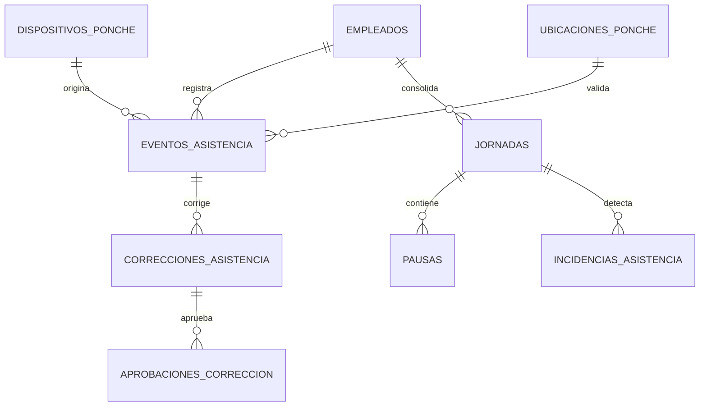
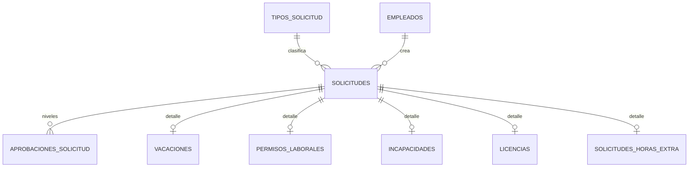
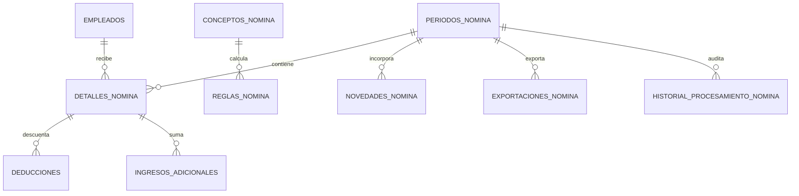
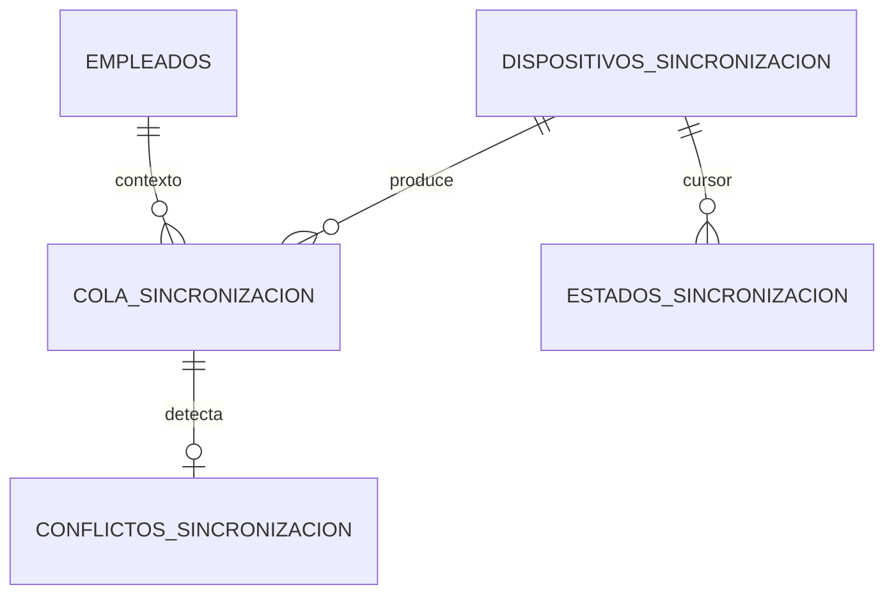

# Diagramas ERD

## General

## Seguridad

## Empleados y horarios

## Asistencia

## Solicitudes

## Nómina

## Sincronización

## Clasificación

- Maestras: empresas, sucursales, departamentos, puestos, roles, permisos, conceptos, horarios.
- Transaccionales: solicitudes, jornadas, nómina en proceso, trabajos de exportación.
- Históricas/append-only: eventos de asistencia, correcciones, auditoría, historial salarial, historial laboral, historial de permisos y procesamiento de nómina.
- No deben borrarse físicamente: asistencia sincronizada, correcciones, aprobaciones, nómina aprobada, auditoría, eventos de seguridad y conflictos resueltos.

Las relaciones 1:1 separan identidad/perfil/empleado; 1:N modelan pertenencia e históricos; N:M se implementan con tablas puente para permisos, horarios y alcances.
